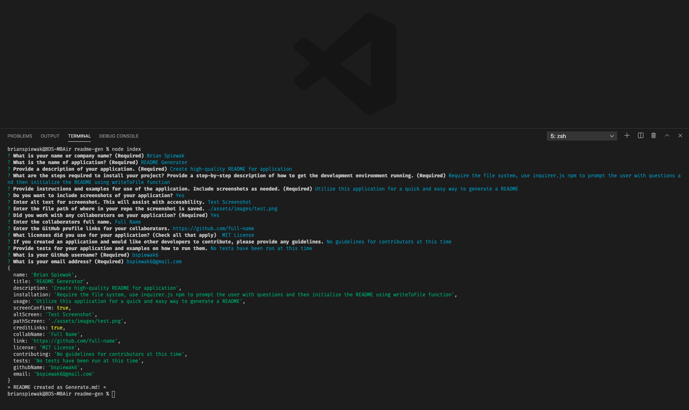
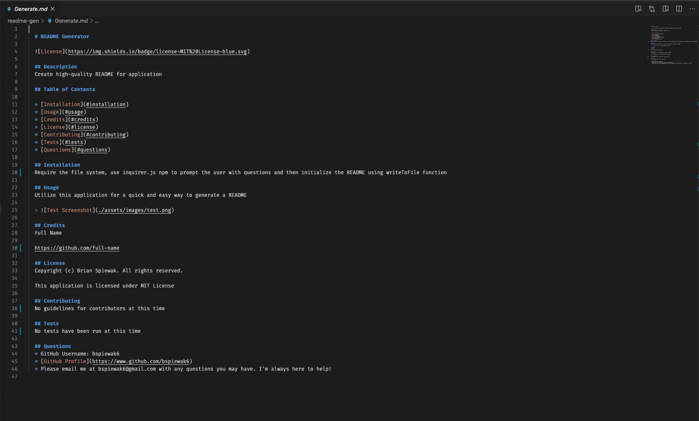

# README Generator

## Table of Contents
* [User Story](#user-story)
* [Criteria](#criteria)
* [Technologies](#technologies)
* [Screenshots](#screenshots)
* [Links](#links)

## User Story
AS A developer  
I WANT a README generator  
SO THAT I can quickly create a professional README for a new project

## Criteria
GIVEN a command-line application that accepts user input  
WHEN I am prompted for information about my application repository  
THEN a high-quality, professional README.md is generated with the   
title of my project and sections entitled Description, Table of  
Contents, Installation, Usage, License, Contributing, Tests, and Questions  
WHEN I enter my project title  
THEN this is displayed as the title of the README  
WHEN I enter a description, installation instructions, usage  
information, contribution guidelines, and test instructions  
THEN this information is added to the sections of the README  
entitled Description, Installation, Usage, Contributing, and Tests  
WHEN I choose a license for my application from a list of options  
THEN a badge for that license is added near the top of the README and a notice is added  
to the section of the README entitled License that explains which license the application is covered under  
WHEN I enter my GitHub username  
THEN this is added to the section of the README entitled Questions, with a link to my GitHub profile  
WHEN I enter my email address  
THEN this is added to the section of the README entitled Questions, with instructions on  
how to reach me with additional questions  
WHEN I click on the links in the Table of Contents  
THEN I am taken to the corresponding section of the README  

## Technologies
1. JavaScript
2. Node.js
3. Inquirer.js

## Screenshots

## Links
* [README Generator Walkthrough Video]()
* [README Generated File called Generate.md](https://drive.google.com/file/d/1iVBkwuHtlqmxUxDIQlBdLDv2CPCbYN98/view?usp=sharing)
* [README Generator Repository](https://github.com/bspiewak6/readme-gen)
